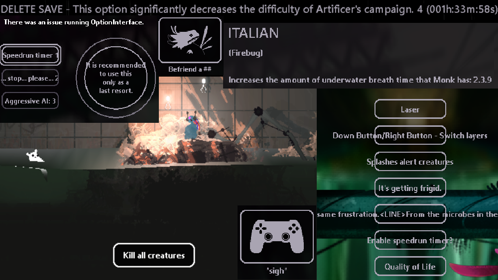

# Text Randomizer
  
Rain World Text Randomizer

Randomizes most text in the game with randomly choosen different text  
**WARNING:** All UI elements will still serve their original purpose but their names / descriptions will be random!  
Its recommened to backup your settings and/or use a different save slot in case you interact with the wrong elements potentially erasing your progress etc!  
(or make sure you know what each button does from memory)

### Help how do I disable this monstrosity
A: Go the main menu. Press the 4th button from the top. Scroll through all the mods until you find this mods thumbnail. Disable that mod and restart the game.  
B: Either unsubscribe from the mod on Steam or in case you manually installed it to remove the mod files in your mod folder  